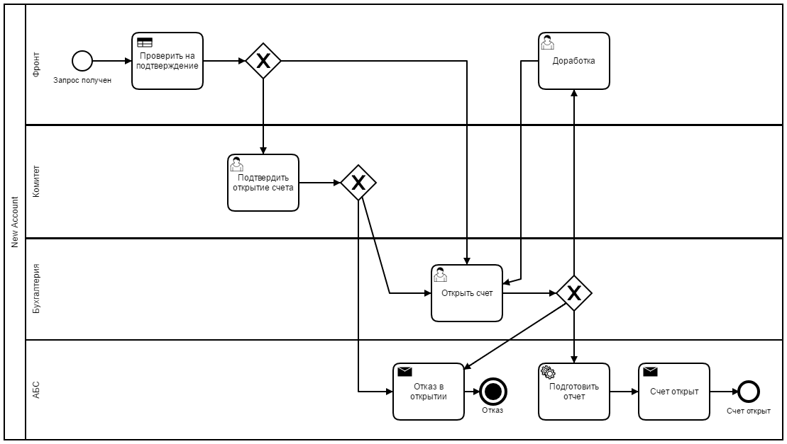

# New Account

Proof of concept for SPA + Camunda BPM application architecture.

Processing applications to open bank account for business entity.

  * Camunda BPM - process orchestration, auth
  * AdminLTE - application theme, forms
  * jQuery - JS framework
  * Bootstrap - UI foundation
  * Kendo UI - Routing framework
  * RequireJS - JS dependency management
  * Java - [External Task execution](https://docs.camunda.org/manual/7.4/user-guide/process-engine/external-tasks/)
  
**WARNING** This is not a real application!!! This is for demo and technology testing!

## Target process

## Structure

  * SPA HTML5 webapp
  * Apache Http 2.4
  * Java task executor application
  * Camunda BPM 7.5.0 bundle
  
Camunda BPM localhost:8080/engine -> localhost:80/bpm
